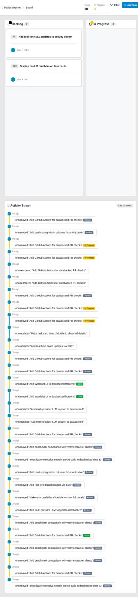

# Task #10: Display Card ID Numbers on Task Cards

## Summary
Added task ID badges to all task cards to enable easy reference when communicating about specific tasks.

## Changes Made

### Template Updates
- Modified `templates/fragments/tasks.templ`
- Added a small badge component displaying task ID (format: `#10`)
- Positioned next to card title using flexbox layout
- Applied `badge-ghost` styling for subtle appearance
- Used monospace font for better readability

### Implementation Details
```go
<div class="flex items-center gap-2 flex-1 min-w-0">
    <span class="badge badge-ghost badge-sm text-xs font-mono shrink-0">#{ strconv.Itoa(task.ID) }</span>
    <h3 class="card-title text-sm cursor-pointer hover:text-primary transition-colors">
        { task.Title }
    </h3>
</div>
```

## Design Decisions

1. **Badge Styling**: Used `badge-ghost` for a subtle, non-distracting appearance
2. **Size**: `badge-sm` keeps it compact and proportional to the card
3. **Font**: Monospace font makes numeric IDs more readable
4. **Position**: Left-aligned next to title for consistent visibility
5. **Responsive**: `shrink-0` prevents badge from shrinking on small screens

## Testing

✅ Built and restarted service successfully
✅ Verified IDs appear on all cards in all columns
✅ Confirmed readability and styling
✅ Screenshot captured showing cards #9 and #10 with visible IDs

## Screenshot



The screenshot shows:
- Card #9: "Add real-time SSE updates to activity stream"
- Card #10: "Display card ID numbers on task cards"

Both cards clearly display their ID badges in a subtle, readable format.

## Branch & PR

- **Branch**: `feature/display-task-id-on-cards`
- **Commit**: Added task ID badges with proper styling
- **PR Link**: https://github.com/j0hnsmith/botTaskTracker/pull/new/feature/display-task-id-on-cards

## Next Steps

1. Review the PR on GitHub
2. Merge to master once approved
3. Deploy to production

## Notes

- The ID display is automatic for all existing and future cards
- No database changes required
- Minimal performance impact (just string conversion)
- Compatible with all existing card states (backlog, in progress, review, done)
